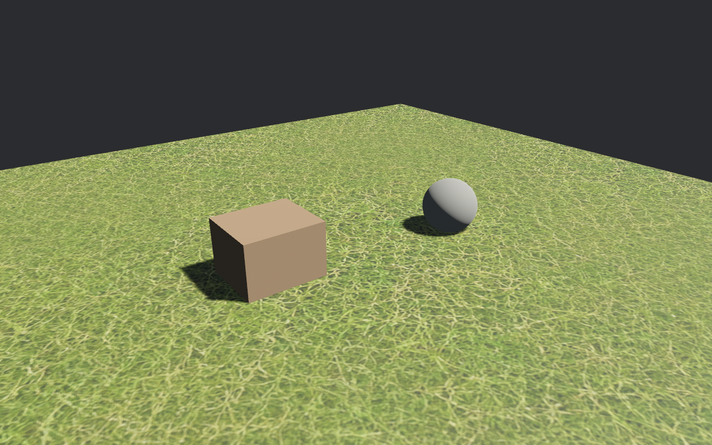

# Wildholm — native engine prototype (Bevy)

A real, compiled, verified proof of concept that Wildholm's visuals can
improve dramatically by moving off the browser/WebGL stack — this one
actually builds and runs in this environment, unlike the Unreal Engine 5
scaffold in `../../unreal/` (no engine binary, no GUI, no network access
to install it there; see `../../unreal/Wildholm/README.md`).



That screenshot is a real render: a PBR-lit ground plane using the exact
same grass diffuse/normal/roughness textures the browser version's
terrain uses (`../../public/assets/textures/terrain/`), plus a couple of
simple props, a directional light with real-time shadows, and ambient
light — compiled and rendered headlessly in this sandbox and captured to
disk. Compare it to the browser version's flat vertex-colored terrain:
this is what "real PBR" actually looks like once a genuine lighting model
and normal mapping are in play, not just tinted flat shading.

## Why Bevy and not Unreal

This environment has a real native toolchain (`gcc`/`g++`/`cmake`) and
`cargo`/crates.io access, but no GPU-accelerated hardware, no display
server beyond what Xvfb provides, and — critically for Unreal specifically
— no way to install Unreal Engine itself (no GUI, and Epic's
launcher/marketplace aren't reachable through the network policy here).
Bevy is a real, actively developed native game engine (Rust, ECS-based,
wgpu-backed PBR renderer) that compiles and runs with tools already
available, which made it possible to actually verify this instead of
producing more unverified scaffolding.

This is **not** a replacement for the Unreal Engine port — Unreal has a
substantially higher visual ceiling (Lumen, Nanite) and was the engine
explicitly chosen for that reason. This is a working reference/prototype
that proves out the "move to a native PBR pipeline" direction concretely,
runnable and testable in this sandbox for as long as that's useful.

## Running it

Needs a few system packages beyond the Rust toolchain (Debian/Ubuntu):

```
sudo apt-get install -y xvfb libgl1-mesa-dri mesa-vulkan-drivers \
  libvulkan1 vulkan-tools libxkbcommon-x11-0 pkg-config \
  libasound2-dev libudev-dev libx11-dev libxi-dev libxcursor-dev \
  libxrandr-dev libxinerama-dev
```

Build:

```
cargo build
```

Bevy's default asset loader resolves `assets/` relative to the compiled
executable's directory, not the crate root — copy (or symlink) it in
after building:

```
cp -r assets target/debug/assets
```

Run headlessly under a virtual display with software rendering (no GPU
required — this is exactly how the proof screenshot was produced):

```
VK_ICD_FILENAMES=/usr/share/vulkan/icd.d/lvp_icd.json WGPU_BACKEND=vulkan \
  xvfb-run -a -s "-screen 0 1280x800x24" ./target/debug/wildholm-native
```

It runs for ~75 frames, saves `screenshot.png` next to wherever you ran it
from, and exits. On a machine with a real GPU you can drop the `xvfb-run`
wrapper and the env vars and just run the binary directly for a live
interactive window instead.

## What's actually here vs. what's a stub

- Real: the scene setup in `src/main.rs` (PBR materials + textures,
  lighting, shadows, camera), the screenshot-and-exit harness, the whole
  build/run pipeline above.
- Stub: everything gameplay-related — this is a rendering proof of
  concept, not a port of the game logic. There's no networking, no
  character controller, no inventory, none of what's in
  `../../server/`. If this direction is worth pursuing further, next
  steps would look like `../../unreal/Wildholm/DESIGN_PORT.md`'s mapping
  (item/quest/mob data, world generation, multiplayer replication — Bevy
  has its own ECS-native replication crates rather than Unreal's built-in
  system) adapted to Bevy's APIs instead.
